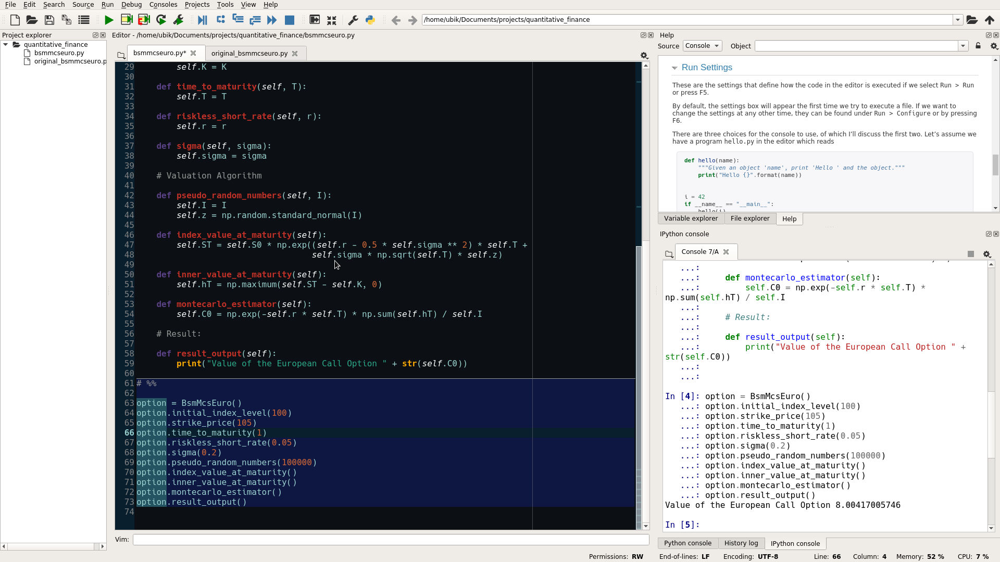

## Description

Spyder syntax based on my [ubik-syntax for the Atom editor](https://atom.io/themes/ubik-syntax), both themes draw heavily from the [Gotham vim colorscheme](https://github.com/whatyouhide/vim-gotham).

Suggestions are wholeheartedly welcomed.

### Screenshot



### Installation

Copy the following code inside your __spyder.ini__ file after the other colorschemes.

(You should find the spyder.ini file inside your `~/.config/spyder` or equivalent folder)


```python
custom_names = ['custom-0']
custom-0/definition = ('#33859e', False, False)
custom-0/comment = ('#969896', False, False)
custom-0/matched_p = #00a433
custom-0/unmatched_p = #c23127
custom-0/builtin = ('#d3ebe9', False, False)
custom-0/instance = ('#c23127', False, False)
custom-0/occurrence = #245361
custom-0/ctrlclick = #0000ff
custom-0/keyword = ('#195466', False, False)
custom-0/string = ('#42ffc0', False, False)
custom-0/background = #0c1014
custom-0/sideareas = #0c1014
custom-0/currentcell = #0c1014
custom-0/normal = ('#99d1ce', False, False)
custom-0/currentline = #000614
custom-0/number = ('#d26937', False, False)
custom-0/name = Ubik-Gotham
```
